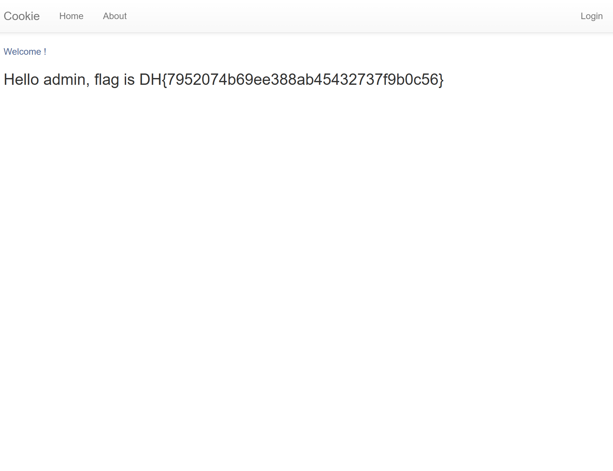

# 📂 Case Analysis: cookie

## 1. 문제 정보 (Challenge Info)
- **Description**: 쿠키로 인증 상태를 관리하는 간단한 로그인 서비스입니다. admin 계정으로 로그인에 성공하면 플래그를 획득할 수 있습니다.
- **Target**: 드림핵 워게임 서버 (cookie)
- **Flag Format**: `DH{...}`

## 2. 분석 개요 (Overview)
- **Objective**: 취약한 쿠키 관리 메커니즘을 분석하여, `admin` 계정의 세션을 임의로 생성하고 권한을 획득함.
- **Key Concept**: Insecure Cookie Handling, Authentication Bypass

## 3. 분석 환경 (Environment)
- **OS**: Windows 11
- **Browser**: Google Chrome (DevTools)
- **Tools**: Chrome DevTools (Application Tab), Python (Source Analysis)

## 4. 분석 및 해결 단계 (Steps)

### Step 1: 서버 소스 코드 분석 (White-box)
제공된 `app.py` 소스 코드를 분석하여 플래그 출력 조건을 확인하였습니다.
- **코드 로직**: `request.cookies.get('username')`을 통해 쿠키 값을 읽어옴.
- **취약점**: 쿠키의 `username` 값이 정확히 `admin`일 경우 별도의 인증 절차 없이 `FLAG`를 반환함.

### Step 2: 정상 쿠키 확보 및 변조
1. 소스 코드에서 파악한 테스트 계정(`guest` / `guest`)으로 로그인을 수행하여 정상적인 세션 쿠키를 발급받았습니다.
2. `Application > Cookies` 탭에서 생성된 `username=guest` 쿠키를 확인하였습니다.
3. 해당 쿠키의 값을 `admin`으로 manipulation하여 서버가 관리자로 인식하도록 설정하였습니다.

### Step 3: 권한 상승 및 플래그 획득
변조된 쿠키를 소유한 상태에서 메인 페이지(`/`)로 새로고침을 수행하였습니다.
- 서버는 쿠키 값에 근거하여 현재 사용자를 `admin`으로 식별하고 플래그를 반환하였습니다.

## 5. 결과 (Result)

### Flag 획득 화면
 

- **Flag**: `DH{7952074b69ee388ab45432737f9b0c56}`

## 6. 보안 인사이트 (Retrospective)
- **Root Cause**: 인증된 사용자의 식별 정보를 조작 가능한 형태(평문 쿠키)로 클라이언트에게 위임함.
- **Countermeasures**: 
  - 인증 상태는 서버 세션에서 관리하고, 클라이언트에는 무작위 세션 키(Session ID)만 제공해야 함.
  - 쿠키 데이터의 위변조 방지를 위해 서명(Signing) 또는 암호화를 적용해야 함.
