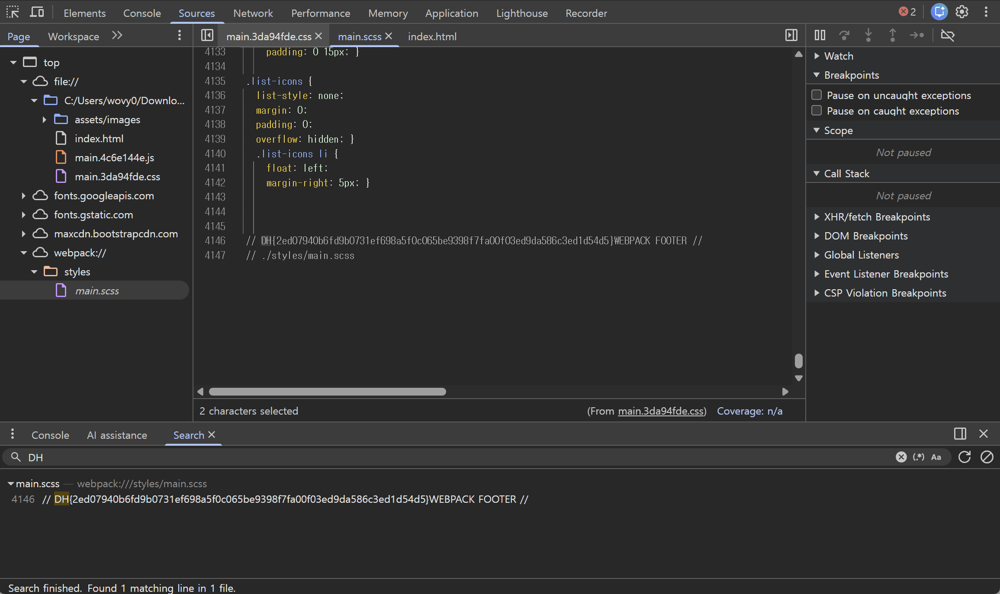

# 📂 Case Analysis: devtools-sources

## 1. 분석 개요 (Overview)
- **Target**: 드림핵 워게임 서버 (devtools-sources)
- **Category**: Web Hacking (Client-side)
- **Goal**: 브라우저 개발자 도구를 활용한 클라이언트 사이드 소스 코드 분석 및 플래그 획득

## 2. 사용 도구 (Tools)
- **Chrome DevTools**: Sources 탭을 활용한 정적 리소스 분석

## 3. 분석 및 해결 단계 (Steps)

### Step 1: 대상 페이지 분석
문제 페이지 접속 후, 사용자에게 노출되는 자바스크립트 및 HTML 구조를 파악하기 위해 브라우저 개발자 도구(`F12`)를 실행합니다.

### Step 2: Sources 탭을 통한 코드 확인
`Sources` 탭으로 이동하여 현재 페이지에서 로드된 정적 파일 리스트를 탐색합니다.
- `index.html` 내부에 포함된 자바스크립트 소스 코드나 외부에서 참조된 `.js` 파일을 중점적으로 분석합니다.

### Step 3: 취약점 식별 및 데이터 추출
소스 코드 내에 하드코딩된 플래그(Flag) 문자열이나, 특정 로직에 의해 동적으로 생성되는 플래그 조각을 확인합니다.
- 본 문제에서는 소스 코드 내에 플래그가 주석처리 되어 있거나 특정 변수에 저장되어 있음을 확인하였습니다.

## 4. 최종 결과 (Result)

### Flag 획득 화면
획득한 플래그 조각들을 조합하여 아래와 같이 최종 플래그를 확인하였습니다.

 
*(Sources 탭 내에서 식별한 플래그 데이터)*

- **Flag**: `DH{2ed07940b6fd9b0731ef698a5f0c065be9398f7fa00f03ed9da586c3ed1d54d5}` (실제 얻은 값을 입력하세요)

## 5. 보안 인사이트 (Retrospective)
- **Root Cause**: 클라이언트에게 전송되는 자바스크립트 코드에 민감한 정보(Flag)가 노출되어 있음.
- **Countermeasures**: 중요 데이터나 권한 검증 로직은 반드시 서버 측(Server-side)에서 처리해야 하며, 클라이언트 코드는 난독화를 적용하여 분석을 어렵게 만들어야 함.
