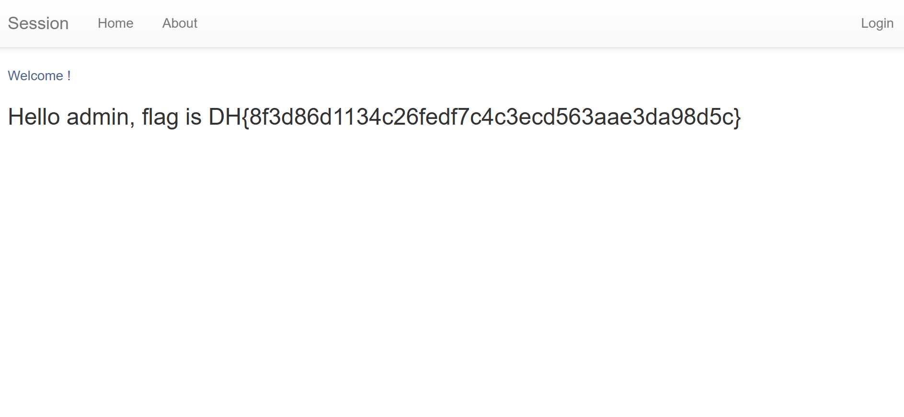

# 📂 Case Analysis: session-basic

## 1. 문제 정보 (Challenge Info)
- **Description**: 쿠키와 세션으로 인증 상태를 관리하는 간단한 로그인 서비스입니다. admin 계정으로 로그인에 성공하면 플래그를 획득할 수 있습니다.
- **Target**: 드림핵 워게임 서버 (session-basic)
- **Flag Format**: `DH{...}`

## 2. 분석 개요 (Overview)
- **Objective**: admin 세션 정보가 노출되는 경로를 찾아 Session ID를 확보하고, 이를 통해 admin 권한을 획득함.
- **Key Concept**: Information Disclosure, Broken Access Control

## 3. 분석 환경 (Environment)
- **OS**: Windows 11
- **Browser**: Google Chrome
- **Tools**: Chrome DevTools (Application Tab), Python (Source Analysis)

## 4. 분석 및 해결 단계 (Steps)

### Step 1: 서버 소스 코드 분석 (White-box)
제공된 app.py 소스 코드를 분석하여 플래그 출력 조건을 확인하였습니다.
- **핵심 로직**: 세션 ID로 32바이트의 난수(os.urandom(32).hex())를 사용하여 Brute-forcing이 불가능하도록 설계되어있습니다.
- **취약점**: @app.route('/admin') 경로가 정의되어 있는데, 내부 로직이 모두 주석 처리되어 있습니다. 결과적으로 해당 페이지에 접속하면 session_storage 딕셔너리 전체가 화면에 출력됩니다.

### Step 2: 취약점 탐색 및 환경 구축
1. 브라우저 주소창에 [Target_URL]/admin을 입력하여 직접 접속하였습니다.
2. 서버에서 관리 중인 session_storage 리스트가 화면에 노출되는 것을 확인하였습니다.
3. 데이터 중 'admin' 계정에 할당된 64자리 16진수 세션 ID 값을 복사하였습니다.

### Step 3: 취약점 공격 (Exploit) 및 플래그 획득
1. 메인 페이지(/)로 이동한 뒤 개발자 도구(F12) -> Application -> Cookies 탭을 확인하였습니다.
2. 기존의 sessionid 쿠키 값을 /admin 페이지에서 획득한 관리자의 세션 ID로 수정하였습니다.
3. 페이지를 새로고침(F5) 하면 서버가 전송된 쿠키를 기반으로 사용자를 admin으로 인식하며 플래그가 출력됩니다.

## 5. 결과 (Result)

### Flag 획득 화면

- **Flag**: `DH{8f3d86d1134c26fedf7c4c3ecd563aae3da98d5c}`

## 6. 보안 인사이트 (Retrospective)
- **Root Cause**: 개발 및 디버깅 목적으로 생성한 관리자 페이지가 적절한 인증 로직 없이 운영 서버에 방치되어 민감 정보가 유출됨.
- **Countermeasures**:
  - 세션 저장소와 같이 민감한 시스템 데이터를 출력하는 페이지는 배포 전 반드시 삭제하거나 엄격한 인증 및 접근 제어를 적용해야 함.
  - 소스 코드 내 주석 처리된 미완성 기능을 점검하고, 실제 운영 환경에서 실행되지 않도록 코드 감사를 정기적으로 실시해야 함.
