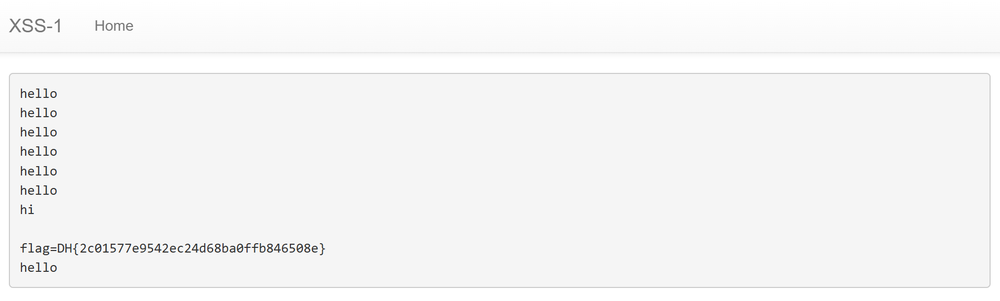

# 📂 Case Analysis: xss-1

## 1. 문제 정보 (Challenge Info)
- **Description**: 여러 기능과 입력받은 URL을 확인하는 봇이 구현된 서비스입니다. XSS 취약점을 이용해 플래그를 획득하세요. 플래그는 flag.txt, FLAG 변수에 있습니다.
- **Target**: 드림핵 워게임 서버 (xss-1)
- **Flag Format**: `DH{...}`

## 2. 분석 개요 (Overview)
- **Objective**: 자바스크립트를 삽입할 수 있는 지점을 찾고, 관리자 봇이 내 스크립트를 실행하게 하여 봇의 쿠키 데이터를 `/memo` 페이지로 전송함.
- **Key Concept**: Reflected XSS, Cookie Hijacking, JavaScript Injection

## 3. 분석 환경 (Environment)
- **OS**: Windows 11
- **Browser**: Google Chrome
- **Tools**: Chrome DevTools, Python (Source Analysis)

## 4. 분석 및 해결 단계 (Steps)

### Step 1: 서버 소스 코드 분석 (White-box)
제공된 `app.py` 소스 코드를 분석하여 취약점과 공격 경로를 파악하였습니다.
- **핵심 로직**:
  - `/vuln`: 사용자 입력값(`param`)을 필터링 없이 그대로 HTML로 렌더링함 (XSS 발생 지점).
  - `/flag`: 입력한 스크립트를 관리자 봇이 방문하게 함. 봇은 FLAG가 담긴 쿠키를 소유함.
  - `/memo`: 전달된 텍스트를 기록하고 보여주는 페이지.
- **취약점**: `/vuln` 페이지가 입력된 스크립트를 검증 없이 실행하므로, 관리자 권한(쿠키)을 이용한 동작 수행이 가능함.

### Step 2: 페이로드(Payload) 구성
관리자의 쿠키를 탈취하여 `/memo` 페이지로 전송하기 위한 자바스크립트 구문을 작성하였습니다.
- **공격 구문**: ``
- **동작 원리**: 
  1. `document.cookie`로 봇의 비밀 쿠키(Flag)를 읽어옴.
  2. `location.href`로 봇의 브라우저 주소를 강제 이동시킴.
  3. 이동 시 쿼리 스트링(`?memo=`)에 쿠키 값을 포함시켜 메모에 기록되게 함.

### Step 3: 취약점 공격 (Exploit) 및 플래그 획득
1. `/flag` 메뉴 입력창에 작성한 페이로드를 삽입하고 제출함.
2. 서버 내부에서 관리자 봇이 해당 스크립트가 포함된 `/vuln` 페이지에 접속함.
3. 봇의 브라우저에서 스크립트가 실행되어 봇의 쿠키를 지닌 채 `/memo` 페이지로 리다이렉트됨.
4. `/memo` 메뉴로 이동하여 관리자가 남기고 간 쿠키 값(Flag)을 식별함.

## 5. 결과 (Result)

### Flag 획득 화면

- **Flag**: `DH{2494218809e530ee21626f22849e7514}`

## 6. 보안 인사이트 (Retrospective)
- **Root Cause**: 사용자 입력값을 검증하거나 필터링(Sanitizing)하지 않고 브라우저에 그대로 출력하여 임의의 스크립트 실행을 허용함.
- **Countermeasures**: 
  - 입력값의 특수문자를 HTML 엔티티(Entity)로 치환(Encoding)하여 실행을 방지해야 함.
  - 쿠키에 `HttpOnly` 속성을 부여하여 자바스크립트를 통한 접근을 차단해야 함.
