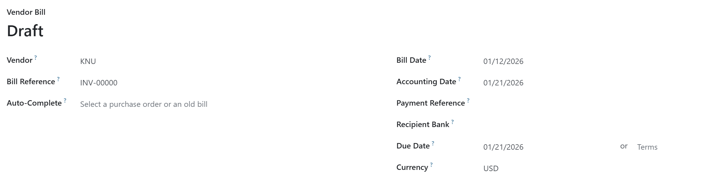

# 📂 Case Analysis: xss-2

## 1. 문제 정보 (Challenge Info)
- **Description**: 동적 페이지 생성 로직의 XSS 취약점을 이용해 관리자의 쿠키를 탈취하는 문제입니다.
- **Target**: 드림핵 워게임 서버 (xss-2)
- **Flag Format**: `DH{...}`

## 2. 분석 개요 (Overview)
- **Objective**: 클라이언트 사이드 스크립트 결함을 식별하고, `<script>` 태그 차단 정책을 우회하여 관리자의 쿠키를 탈취함.
- **Key Concept**: DOM-based XSS, innerHTML Vulnerability, Event Handler Bypass

## 3. 분석 환경 (Environment)
- **OS**: Windows 11
- **Browser**: Google Chrome
- **Tools**: Chrome DevTools (Sources 탭 코드 검색)

## 4. 분석 및 해결 단계 (Steps)

### Step 1: 클라이언트 사이드 소스 분석 (Root Cause)
- **취약 코드 식별**: `vuln.html` 분석 결과, 아래와 같이 URL 파라미터를 처리하는 지점을 확인하였습니다.
  ```javascript
  var x = new URLSearchParams(location.search);
  document.getElementById('vuln').innerHTML = x.get('param');
- **원인 분석**: `URLSearchParams`로 가져온 외부 입력값을 검증 없이 `.innerHTML` 속성에 대입합니다. 이 속성은 문자열을 HTML 태그로 해석하므로 공격자가 임의의 태그를 삽입할 수 있는 **DOM-based XSS** 환경을 제공합니다.

### Step 2: 우회 전략 및 페이로드 구성
- **제약 사항**: `.innerHTML`을 통해 동적으로 삽입된 `<script>` 태그는 브라우저 보안 정책에 의해 실행되지 않습니다.

- **우회 전략**: 태그 없이 스크립트를 실행하는 이벤트 핸들러를 사용합니다. 이미지 로드 실패 시 동작하는 `onerror` 속성을 활용하였습니다.

- **공격 구문**: ``

## 5. 결과 (Result)

### Flag 획득 화면


- **Flag**: `DH{3c01577e9542ec24d68ba0ffb846508f}`

## 6. 보안 인사이트 (Retrospective)
- **Root Cause**: 외부 입력을 HTML 해석기(`.innerHTML`)에 직접 전달하여 브라우저 DOM 구조 조작을 허용함.
- **Countermeasures**: 
  - **Safe API**:태그를 해석하지 않는 `.innerText` 또는 `.textContent`를 사용하여 텍스트로 처리해야 함.
  - **Cookie Security**: `HttpOnly` 속성을 부여하여 스크립트의 쿠키 접근을 차단해야 함.
